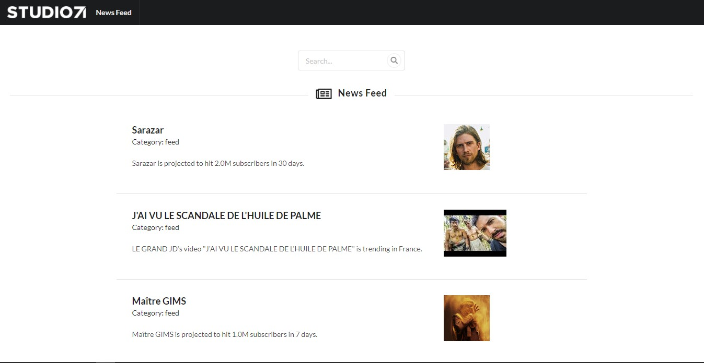

# Studio71 News Feed App

This project was bootstrapped with [Create React App](https://github.com/facebook/create-react-app).

## To Run the Project
- `npm install`
- `npm start`, then open [http://localhost:3000](http://localhost:3000)

## Components
- Topbar (`/components/Topbar.js`)
- News List (`/components/NewsList.js`)
    - Search box
- Scroll to Top (`/components/ScrollToTop.js`)
- Footer (`/components/Footer.js`)
- JSON Data (`/news_feed.json`)

## Used React UI Component Library
[Semantic UI React](https://react.semantic-ui.com/)
